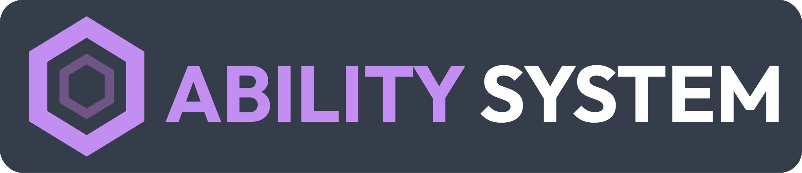

# Ability System - Lógica Orientada a Dados para Godot 4.x

<p align="center">
  
</p>
<br/>

[](https://godotengine.org)
[](LICENSE)

> [!TIP]
> **Leia isto em outros idiomas / Read this in other languages:**
> [**Português**](README.pt.md) | [**English**](README.md)

O **Ability System** (AS) é um framework poderoso para criação de combate, habilidades e atributos modulares. Projetado para escalar desde mecânicas simples até sistemas complexos de RPG — tudo com alta performance em C++ e arquitetura modular.

---

## 📦 Instalação

1. Baixe o `ability-system-plugin.zip` mais recente em nossas [Releases](https://github.com/MachiTwo/AbilitySystemPlugin/releases/download/0.1.0-dev/ability-system-plugin.zip).
2. Extraia e copie a pasta `addons/ability_system` para o diretório `addons/` do seu projeto.
3. Reinicie a Godot e vá em **Projeto > Configurações do Projeto > Plugins** para ativar o plugin "Ability System". Isso ativará o Editor de Tags e as funcionalidades customizadas do Inspetor.

---

## 🛠️ Arquitetura de Build Dual

Este projeto foi projetado exclusivamente para suportar **Compilação Dual**, atendendo tanto ao desenvolvimento do núcleo da engine quanto ao ecossistema de plugins:

- **Zyris Engine (Nativo):** Este framework é um componente nativo do núcleo do **Zyris Engine**. O desenvolvimento neste repositório permite automação centralizada e validação rigorosa. Após estabilizado, o código é oficialmente integrado à branch `master` do Zyris Engine.
- **GDExtension (Plugin):** Uma versão em biblioteca dinâmica para projetos Godot 4.x padrões. Oferece 100% de paridade lógica sem exigir a recompilação do motor, ideal para projetos que utilizam a distribuição oficial da Godot.

Uma base de código C++ unificada alimenta ambas as versões, utilizando um sistema robusto de pré-processamento (`#ifdef ABILITY_SYSTEM_GDEXTENSION`) para gerenciar as diferenças de integração, mantendo uma única fonte de verdade para a lógica.

---

## 🏗️ Guia de Início Rápido

Transforme sua lógica de jogo em dados com estes passos fundamentais. Vamos construir um sistema onde interações sociais e combate coexistem.

### 1. Acesse o Gerenciador de Tags

O Gerenciador de Tags é o coração do vocabulário do seu projeto. Sua localização depende da versão utilizada:

- **GDExtension (Plugin):** Procure pela aba **Ability System Tags** no **Painel Inferior** (ao lado de Output/Debugger).
- **Zyris Engine (Nativo):** Vá em **Projeto > Configurações do Projeto** e procure pela aba **Ability System Tags** logo após o Input Map (Mapa de Entrada).

### 2. Defina o Vocabulário (Tags)

Defina identificadores hierárquicos. Pontos criam ramos que a lógica pode consultar:

- `ability.social.talk`: A base para todas as conversas.
- `state.emotional.angry`: Um estado que pode bloquear interações sociais.
- `state.stun.frozen`: Um estado de combate (congelado).

> [!TIP]
> **Lógica Abrangente:** Verificar por `state.emotional` retornará verdadeiro se o ator tiver `state.emotional.angry` ou `state.emotional.happy`.

### 3. Crie o Esquema de Atributos (AttributeSet)

Crie um recurso **AttributeSet** (ex: `AtributosRPG.tres`).

- Adicione stats de combate: `Saúde`, `Mana`.
- Adicione stats sociais: `Carisma`, `Paciência`.
- Defina valores Mín (0), Máx (100) e Base (100).
- O `AbilitySystemComponent` (ASC) irá **duplicar profundamente** este set ao spawnar, garantindo pools de saúde/paciência únicos para cada NPC.

### 4. Projete Habilidades Sociais (Diálogos)

Crie uma **Ability** (ex: `HabilidadeConversar.tres`):

- **Tag da Habilidade:** `ability.social.talk`.
- **Tags de Ativação Bloqueadas:** Adicione `state.emotional.angry`. Um personagem furioso não consegue iniciar uma conversa educada!
- **Tags de Posse (Owned Tags):** Adicione `state.busy.talking`. Esta tag é concedida *enquanto* a habilidade está ativa e pode ser usada para bloquear outras ações como "Correr".

### 5. Crie Efeitos Emocionais

Crie um **Effect** (ex: `EfeitoRaiva.tres`):

- **Política de Duração:** `Infinite` (Passivo) ou `Duration` (Temporário).
- **Modificadores:** Adicione um modificador para `Carisma` (Multiplicar por 0.5) e `Ataque` (Somar 20).
- **Tags Concedidas:** `state.emotional.angry`.

### 6. Construa o Arquétipo (AbilityContainer)

Crie um **AbilityContainer** (ex: `ArquetipoAldeao.tres`). Este é o seu "Blueprint de NPC":

- Atribua o `AttributeSet`.
- Adicione a habilidade `Conversar` ao catálogo.
- Adicione efeitos padrão (ex: um estado "Neutro").

### 7. Inicialize o Ator (ASC)

Adicione o nó `AbilitySystemComponent` ao seu CharacterBody e atribua o **AbilityContainer** no Inspetor.
Registre seus nós de feedback (AnimationPlayer/Audio) via script para que o sistema possa disparar **Cues** automaticamente.

### 8. Lidando com Lógica de Diálogo Complexa

Use **Tasks** para gerenciar timing assíncrono ou esperar por eventos:

```gdscript
# Dentro de um script de Ability customizado ou disparado via ASC
func _on_activate_ability(owner, spec):
 # 1. Toca uma animação de saudação
 owner.play_montage("greet")
    
 # 2. Espera por um delay ou um evento de tag "DialogoFinalizado"
 var task = AbilitySystemTask.wait_delay(owner, 2.0)
 await task.completed
    
 # 3. Finaliza a habilidade manualmente se necessário
 owner.end_ability(spec)
```

### 9. Combate vs Interação Social

O sistema lida com ambos de forma transparente. Aplicar um efeito "Congelado" irá bloquear automaticamente a habilidade "Conversar" se você adicionar `state.stun` à lista de tags bloqueadas da habilidade.

```gdscript
func interagir_com_npc(npc: AbilitySystemComponent):
 if npc.can_activate_ability_by_tag(&"ability.social.talk"):
  npc.try_activate_ability_by_tag(&"ability.social.talk")
 else:
  print("O NPC está muito furioso ou atordoado para conversar!")
```

### 10. Reagindo a Mudanças de Estado (Sinais)

O ASC notifica sua lógica de jogo quando mudanças significativas ocorrem:

```gdscript
func _ready():
 asc.tag_changed.connect(_on_tag_changed)

func _on_tag_changed(tag: StringName, is_present: bool):
 if tag == &"state.emotional.angry" and is_present:
  $Sprite.modulate = Color.RED # Feedback visual para mudança de emoção
```

---

## 📚 Referências

### 🧠 Componentes Principais

| Componente                 | Propósito                  | Destaques                                                  |
| :------------------------- | :------------------------- | :--------------------------------------------------------- |
| **AbilitySystem**          | Coordenador Global.        | Registro central de Tags, integração com Project Settings. |
| **AbilitySystemComponent** | Processador do Ator (ASC). | Concede/Ativa habilidades, gerencia efeitos, dispara Cues. |

### ⚙️ Recursos

| Resource             | Propósito               | Destaques                                                      |
| :------------------- | :---------------------- | :------------------------------------------------------------- |
| **Ability**          | Lógica de uma ação.     | Custos, Cooldowns e Tags de Ativação nativos.                  |
| **Effect**           | Pacote de alteração.    | Dano instantâneo, buffs temporários ou passivas.               |
| **AttributeSet**     | Container de stats.     | Gerencia coleções de atributos. Instância única por ator.      |
| **Attribute**        | Definição de stat.      | Esquema individual de HP, Mana com limites.                    |
| **AbilityContainer** | Blueprint de Arquétipo. | Catálogo de habilidades e efeitos permitidos.                  |
| **Task**             | Lógica Assíncrona.      | Lida com esperas, delays e timing de animações em habilidades. |
| **Cue**              | Base de Feedback.       | Lógica de ativação de eventos audiovisuais.                    |
| **CueAnimation**     | Feedback de Animação.   | Especializado em tocar montagens nos atores.                   |
| **CueAudio**         | Feedback de Áudio.      | Especializado em tocar sons espaciais ou globais.              |

### 🚀 Objetos de Runtime (Specs)

| Spec            | Propósito                | Dados Chave                                                |
| :-------------- | :----------------------- | :--------------------------------------------------------- |
| **AbilitySpec** | Instância de habilidade. | Nível, estado ativo, consultas de cooldown/custo.          |
| **EffectSpec**  | Instância de efeito.     | Duração restante, stacks, posição (Variant).               |
| **CueSpec**     | Contexto de feedback.    | Magnitude, referências de origem/alvo, dados de impacto.   |
| **TagSpec**     | Gestão de Tags.          | Container de alta performance para tags de estado do ator. |

---

Desenvolvido com ❤️ por **MachiTwo**